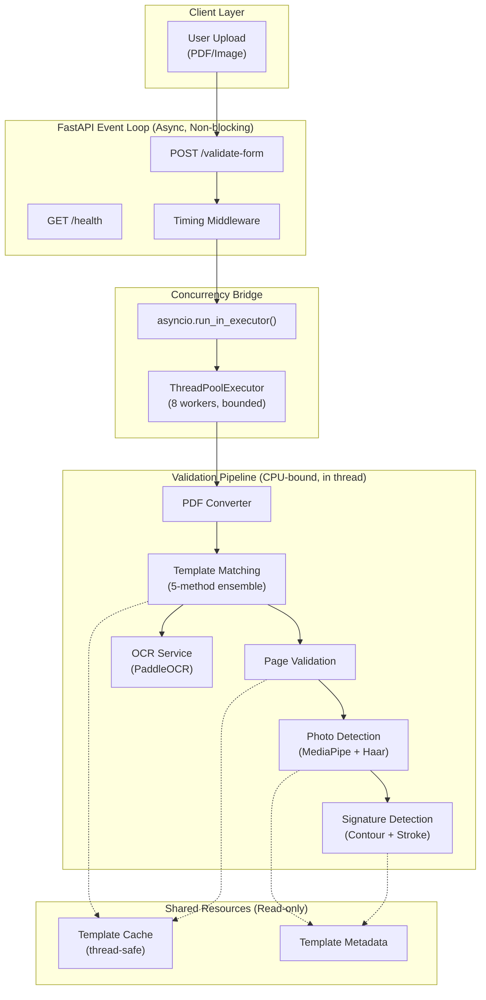
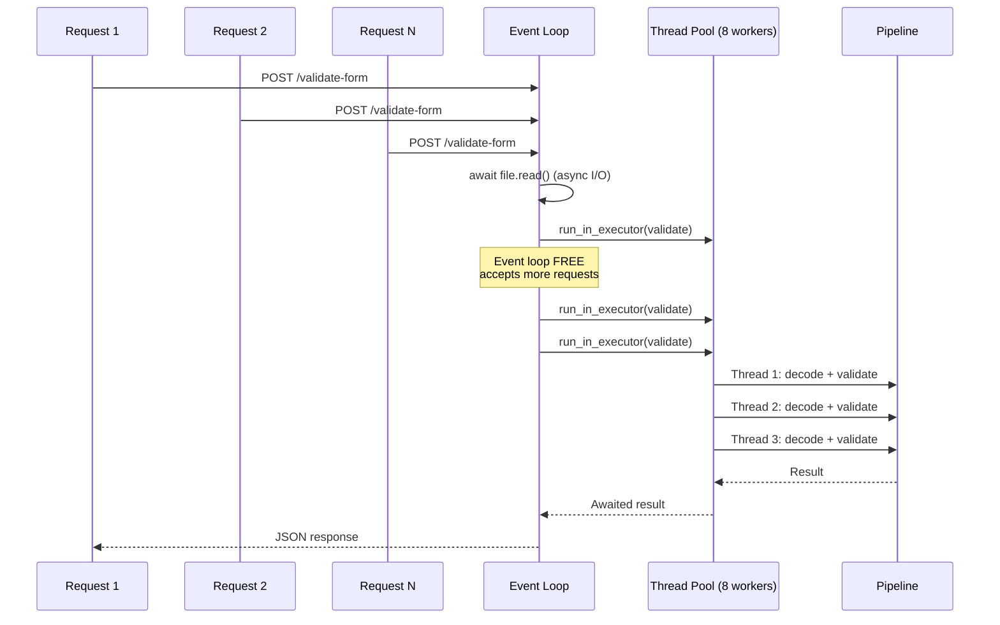
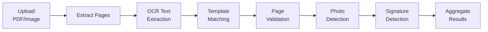

# AI Form Validator — Architecture & Deployment Guide

## Project Summary

Production-grade AI-powered Form Validation System that validates uploaded MKCL application forms against predefined templates. Validates template match, page completeness, passport photo presence, and applicant-only signature detection with high concurrency support (500+ simultaneous users).

---

## Folder Structure

```
Final-FormValidator/
├── app/
│   ├── __init__.py
│   ├── config.py                  # Centralized settings (Pydantic)
│   ├── logging_config.py          # Structured JSON logging
│   ├── main.py                    # FastAPI app + endpoints
│   ├── templates_metadata.py      # Template region coordinates
│   ├── models/
│   │   ├── __init__.py
│   │   └── schemas.py             # Pydantic response models
│   ├── services/
│   │   ├── __init__.py
│   │   ├── template_matching.py   # 5-method ensemble matcher
│   │   ├── page_validation.py     # Page presence + blank detection
│   │   ├── photo_detection.py     # Passport photo + face detection
│   │   ├── signature_detection.py # Applicant-only signature detector
│   │   ├── ocr_service.py         # PaddleOCR + Tesseract fallback
│   │   └── pipeline.py            # Validation orchestrator
│   ├── utils/
│   │   ├── __init__.py
│   │   ├── template_cache.py      # Thread-safe template caching
│   │   ├── image_processing.py    # Preprocessing utilities
│   │   └── pdf_converter.py       # PDF → image conversion
│   └── workers/
│       ├── __init__.py
│       └── executor.py            # ThreadPoolExecutor + async bridge
├── templates/
│   ├── page1-base.jpg             # Page 1 reference template
│   ├── page2-base.jpg             # Page 2 reference template
│   └── mkcl-logo.png              # MKCL logo for detection
├── tests/
│   ├── __init__.py
│   ├── test_services.py           # 24 unit tests
│   ├── test_api.py                # 10 API tests
│   ├── test_concurrency.py        # Load test script (100-1000 users)
│   └── locustfile.py              # Locust load test config
├── requirements.txt
├── run.py                         # Server launcher
├── pytest.ini
├── .env.example
└── how_concurrency_can_be_achieved.txt
```

---

## Architecture Diagram



---

## Concurrency Architecture



| Concurrent Users | Behavior |
|---|---|
| **1–8** | All run truly in parallel. Zero queuing. |
| **9–100** | 8 parallel + internal queue. Event loop stays responsive. |
| **100–500** | Thread pool handles backpressure. Template cache prevents I/O amplification. |
| **500+** | Use `--workers 4` for 4 processes × 8 threads = 32 parallel validations. |

---

## Validation Pipeline



### Template Matching (5-method ensemble)

| Method | Weight | Description |
|---|---|---|
| ORB Features | 25% | Structural keypoint matching with Lowe's ratio test |
| Correlation | 25% | Normalized cross-correlation of full page |
| Header Match | 20% | Header region cross-correlation (top 8%) |
| Logo Detection | 15% | Multi-scale MKCL logo template matching |
| OCR Anchors | 15% | Text anchor verification ("Application Form", "Page X of 2") |

### Signature Detection (Applicant ONLY)

> [!IMPORTANT]
> The system validates ONLY the applicant's signature region using template-defined coordinates. Parent/guardian, office, and verifier signatures are explicitly ignored.

Pipeline:
1. **Crop** applicant signature region using template coordinates
2. **Binarize** with adaptive thresholding to isolate ink
3. **Remove template lines** (horizontal/vertical morphological opening)
4. **Contour analysis** — count, size distribution, stroke density
5. **Handwriting detection** — coefficient of variation of contour areas > 0.3
6. **Reject printed text** — uniform heights + aligned baselines = printed

### Photo Detection (Ensemble)

1. **Region crop** from template coordinates (Page 1 top-right)
2. **Content check** — reject blank white boxes
3. **MediaPipe Face Detection** (primary, high accuracy)
4. **Haar Cascade** (fallback)
5. **Logo/stamp rejection** — bimodal histogram analysis

---

## API Reference

### `POST /validate-form`

**Input:** `multipart/form-data` with `file` field (PDF, JPG, PNG)

**Response:**
```json
{
  "success": true,
  "template_matched": "mkcl_page1",
  "template_match": {
    "matched": true,
    "template_name": "mkcl_page1",
    "confidence": 0.7871,
    "method": "orb"
  },
  "pages": {
    "page1": true,
    "page2": false,
    "total_pages": 1,
    "missing_pages": [2]
  },
  "photo_present": false,
  "photo_validation": {
    "photo_present": false,
    "face_detected": false,
    "confidence": 0.2,
    "region_has_content": true
  },
  "applicant_signature_present": true,
  "signature_validation": {
    "applicant_signature_present": true,
    "confidence": 1.0,
    "stroke_density": 0.083695,
    "contour_count": 27,
    "has_handwriting": true
  },
  "confidence": 0.6511,
  "processing_time_ms": 4659.39,
  "errors": [],
  "warnings": []
}
```

### `POST /validate-form/debug`
Same as above + `debug` field with region coordinates and thresholds.

### `GET /health`
```json
{"status": "ok", "version": "1.0.0", "templates_loaded": true, "worker_pool_size": 8}
```

---

## Running the System

### Development
```bash
pip install -r requirements.txt
python run.py --reload
# Server at http://localhost:9000
# Swagger docs at http://localhost:9000/docs
```

### Production
```bash
python run.py --workers 4 --port 9000
# 4 processes × 8 threads = 32 parallel validations
```

### Running Tests
```bash
# Unit + API tests (34 tests)
python -m pytest tests/ -v

# Load test (100 concurrent users)
python tests/test_concurrency.py --users 100 --url http://localhost:9000

# Load test (100, 500, 1000 tiers)
python tests/test_concurrency.py --tiers --url http://localhost:9000

# Locust UI (interactive)
locust -f tests/locustfile.py --host http://localhost:9000
```

---

## Configuration

All settings configurable via environment variables (prefix `FV_`):

| Variable | Default | Description |
|---|---|---|
| `FV_MAX_WORKERS` | `min(CPU, 8)` | Thread pool size per process |
| `FV_UVICORN_WORKERS` | `4` | Process-level parallelism |
| `FV_TEMPLATE_MATCH_THRESHOLD` | `0.35` | Minimum score to accept template match |
| `FV_PHOTO_MIN_FACE_CONFIDENCE` | `0.50` | Minimum face detection confidence |
| `FV_SIGNATURE_MIN_STROKE_DENSITY` | `0.005` | Minimum ink density for signature |
| `FV_LOG_LEVEL` | `INFO` | Logging level |
| `FV_LOG_JSON` | `true` | JSON structured logging |
| `FV_MAX_UPLOAD_SIZE_MB` | `20` | Upload size limit |

---

## Test Results

```
34 passed in 33.28s

tests/test_services.py — 24 tests (cache, image, template, page, photo, signature, pipeline)
tests/test_api.py      — 10 tests (health, validation, errors, debug)
```

## Live Validation Result (page1-base.jpg)

| Check | Result |
|---|---|
| Template Match | ✅ `mkcl_page1` (78.7% confidence) |
| Page 1 Present | ✅ |
| Logo Detected | ✅ |
| Correct Form | ✅ |
| Photo Present | ❌ (blank template — no photo pasted) |
| Applicant Signature | ✅ detected in region |
